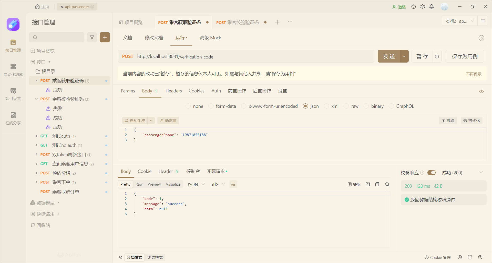
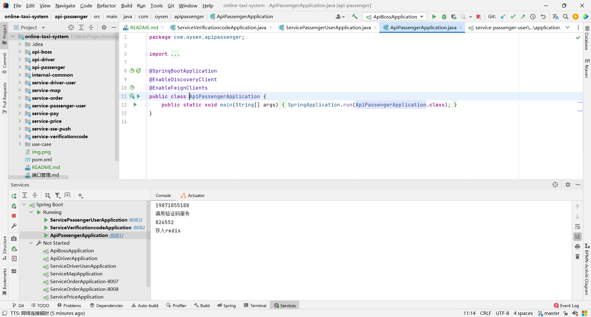
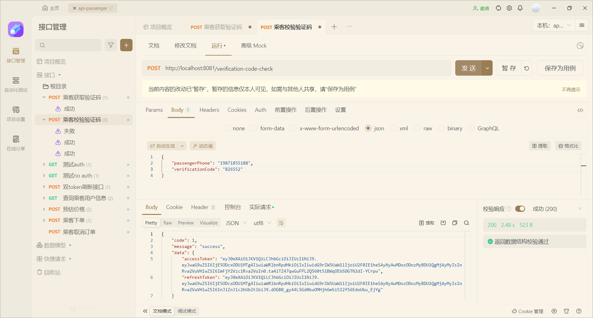
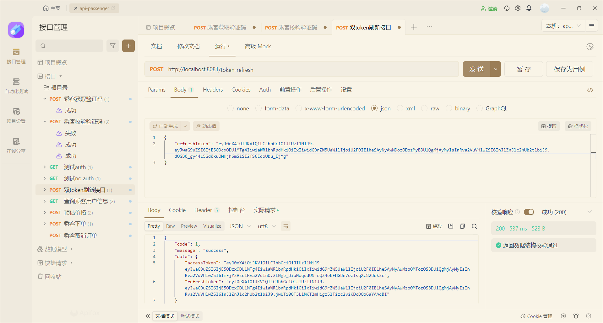

# 工程简介
### 对外用户功能接口
用户功能对外接口，对外提供调用接口，通过此项目对外接口调用内部功能，使用openfeign调用
# 延伸阅读
## 示例
#### 用户注册功能(获取验证码)----->api-passenger  调用service-verificationcode服务生成验证码

###### 后端输出调用成功数据 ---api-passenger

#### 用户注册功能(校验验证码) ----->api-passenger 服务校验存入redis的验证码(验证码有效时间2分钟)

##### 校验验证码成功，后端返回token(accessToken为正常使用的token，refreshToken为备用token)

#### 刷新token
