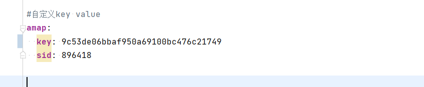

# 工程简介
### 地图功能模块

# 延伸阅读
### 接口情况
##### service-map  http://localhost:8085

+ 根据起点和终点获取距离和时长
    + 接口 /direction/driving (get)
+ 获取地区字典
    + 接口 /dic-district (get)
+ 创建地图服务
    + 接口
+ 创建终端
    + 接口
+ 创建轨迹
    + 接口
+ 轨迹位置上传
    + 接口
+ 终端搜索
    + 接口
+ 查找终端在某个时间段的轨迹
    + 接口

自定义地图key，value

需要向高德地图开放平台申请web服务的key，然后生成sid

