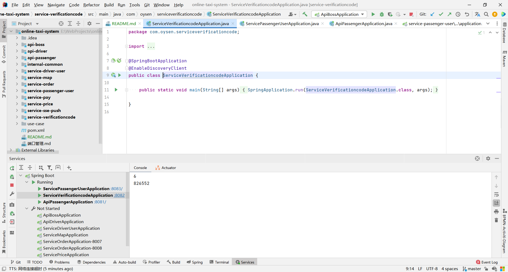

# 工程简介
### 生成验证码服务
此服务用于生成验证码，供api-driver和api-passenger调用生成验证码使用
# 延伸阅读
### 接口说明
##### service-verificationcode  http://localhost:8082

+ 生成验证码
    + 接口 /numberCode/{size} (get)
### 示例
#### 用户注册功能(获取验证码)----->api-passenger  调用service-verificationcode服务生成验证码
##### 后端输出调用成功数据 ---service-verificationcode

